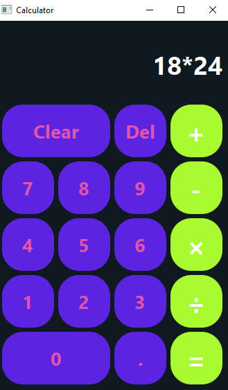

# Calcify

A modern, stylish desktop calculator application built with Python and PySide6. Calcify features a custom GUI, safe expression evaluation, and a smooth user experience. Perfect for quick, reliable calculations on your desktop.

## Features

- Intuitive and visually appealing user interface
- Safe evaluation of mathematical expressions
- Basic arithmetic operations (+, -, ×, ÷)
- Responsive design with custom styles
- Easily extendable for more advanced features

## Screenshots



## Getting Started

### Prerequisites
- Python 3.8+
- PySide6

### Installation
1. Clone the repository:
   ```sh
   git clone https://github.com/yourusername/Calcify.git
   cd Calcify
   ```
2. Install dependencies:
   ```sh
   pip install -r requirements.txt
   ```

### Running the Application
```sh
python run.py
```

## Project Structure
- `run.py` — Entry point for the application
- `calculator_back.py` — Calculator logic and main window
- `ui_calculator.py` — Auto-generated UI code from Qt Designer
- `calculator.ui` — Qt Designer UI file

## Contributing
Contributions are welcome! Please open issues or submit pull requests for improvements and new features.

## License
This project is licensed under the MIT License. See the [LICENSE](LICENSE) file for details.
